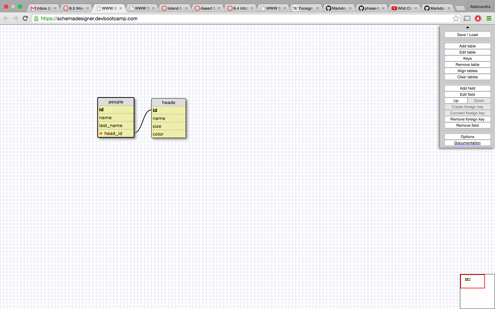
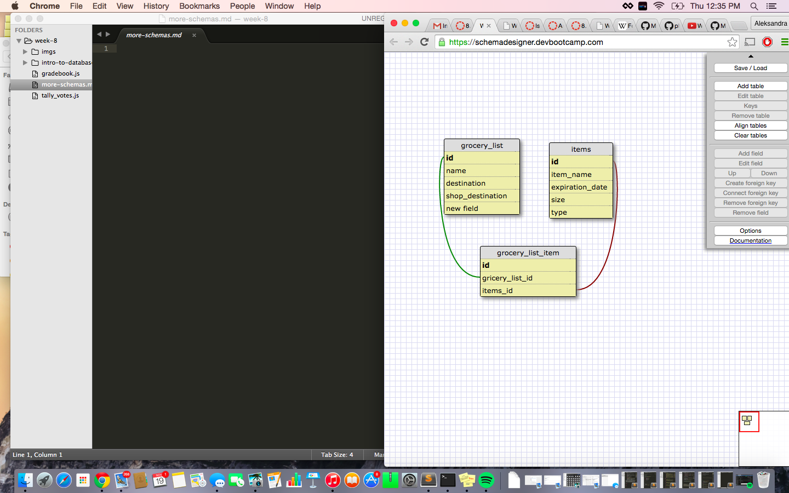

What is a one-to-one database?

We use it when we want to conect for example one person with one id_card. Yhe same with id_card, it cannot belong to many people, it has to elong to one perosn. 

When would you use a one-to-one database? (Think generally, not in terms of the example you created).

We use it when we want to conect for example one person with one id_card. Yhe same with id_card, it cannot belong to many people, it has to elong to one perosn. 

What is a many-to-many database?

We use it when many things has many otherthings.

When would you use a many-to-many database? (Think generally, not in terms of the example you created).

For example many people can have many houses, and many house can have many owners. 

What is confusing about database schemas? What makes sense?

Many to many, one to one, one to many has a lot of sense. 