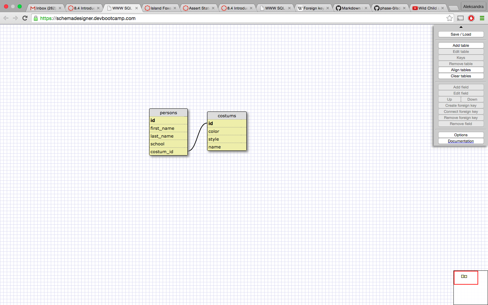

# Introduction to Databases

#### I worked on this challenge [by myself, with: ]
#### This challenge took me [#] hours.

## SQL Queries

Paste the correct SQL queries for each of the following:

1. Select all data for all states: 

SELECT * FROM states

2. Select all data for the regions:

SELECT * FROM regions;

3. Select the `state_name` and `population` for all states: 

SELECT state_name, population
FROM states;

4. Select the `state_name` and `population` for all states ordered 
by population. The most populous state should be at the top:

SELECT state_name, population  
FROM states
ORDER BY population desc;

5. Select the 'state_name's for the states in region 7:

SELECT state_name  
FROM states
WHERE region_id = 7;

6. Select the 'state_names' and 'population_density' with a population density over 50 ordered from least to most dense:

SELECT state_name, population_density
FROM states; 
WHERE population_density <= 50
ORDER BY population_density asc;

7. Select all state_names for states with a population between 1 million and 1.5 million people:

SELECT states_name
FROM states
WHERE population BETWEEN 1000000 AND 1500000;

8. Select all state_names and region_id ordered by region in ascending order:

SELECT state_names, region_id
FROM states
ORDER BY region asc;

9. Select the 'region_name' for the regions with "Central" in the name:

SELECT region_name
FROM regions
WHERE region_name = "Central";

10. Select all of the region names and the state names in ascending order by regional id:

SELECT region_name, state_name 
FROM states, regions
WHERE states.region_id = regions.id
ORDER BY region_id asc;

## `persons` and `outfits` Schema
<!-- Include a link to your schema design here -->
[Schema Design in XML](https://github.com/nowakoff/phase-0/blob/master/week-8/intro-to-databases/schema.xml)

## Reflection
What are databases for?

To store info in organized way.

What is a one-to-many relationship?

It means that for example one hand can have many fingers, but those fingers cannot have many hands. The same in DBs.

What is a primary key? What is a foreign key? How can you determine which is which?

Primary key is the main key in the table. Foreign key is the key that conect forign table with the main table.

How can you select information out of a SQL database? What are some general guidelines for that?

You use sql queries like SELECT * FROM table_name